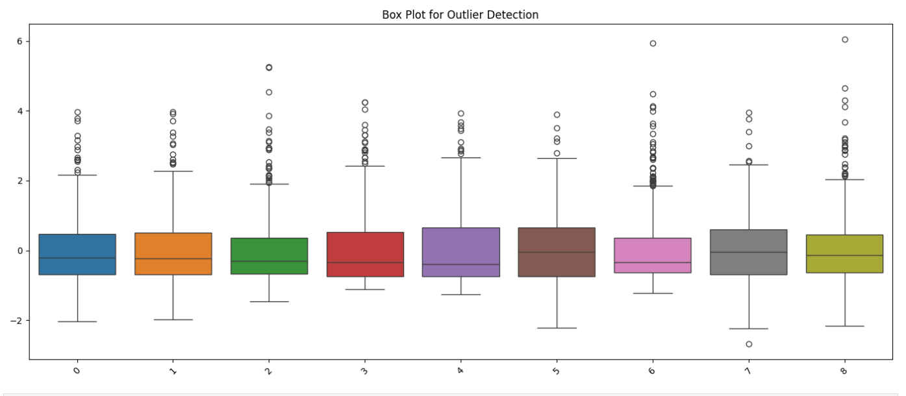

# Tumor_Classifier_Model
This Is My First Trained Model Using Scikit-learn (LogisticRegression)


I Dont KNow How To Start So HERE WE GO AGAIN!

libraries:

```python
import sklearn as sk
import pandas as  pd
import numpy as np
import matplotlib.pyplot as plt
import seaborn as sns
```

Modules From Sklearn(Scikit-learn):

```python
from sklearn.preprocessing import StandardScaler
from sklearn.linear_model import LogisticRegression
from sklearn.pipeline import make_pipeline
from sklearn.metrics import confusion_matrix, ConfusionMatrixDisplay
from sklearn.model_selection import train_test_split
```

I Used Dataset From [Kaggle](https://www.kaggle.com)

[Interesting Data to Visualize](https://www.kaggle.com/datasets/alexisbcook/data-for-datavis?select=cancer.csv)-Cancer.csv

Don't Know Why He Thinks Cancer Is "INTERESTING" Thing To Happen!

cancer_df.head(5): Cant fit All Columns

.png)


All The Features From Cancer.csv - (569, 32)
```python
Id, Diagnosis, Radius (mean), Texture (mean), Perimeter (mean)

Area (mean), Smoothness (mean), Compactness (mean), Concavity (mean)

Concave points (mean), Symmetry (mean), Fractal dimension (mean)

Radius (se), Texture (se), Perimeter (se), Area (se)

Smoothness (se), Compactness (se), Concavity (se), Concave points (se)

Symmetry (se), Fractal dimension (se)

Radius (worst), Texture (worst), Perimeter (worst), Area (worst)

Smoothness (worst), Compactness (worst), Concavity (worst)

Concave points (worst), Symmetry (worst), Fractal dimension (worst)
```
# Data Visualization 
Now We Need Impotant Features To Predict Tumor Classifiaction:

  *in This Dataset We Have Column 'DIAGNOSIS' It's  Value Is Either M OR B [M: Malignant (cancer), B: Benign (not cancer)]


Before We Plot Our Heatmap, We Need To Convert The String Values To Int/Float. 

So We Could Use Panda To Change M : 1 AND B : 0

```python

Cancer_df["Diagnosis"] = Cancer_df["Diagnosis"].replace("M", 1)
Cancer_df["Diagnosis"] = Cancer_df["Diagnosis"].replace("B", 0)

```

Lets Plot The HeatMap - Correlation Between Features and Lable/Target(Diagnosis):

```python

plt.figure(figsize=(30, 40))  
corr = Cancer_df.corr(numeric_only= True)
sns.heatmap(corr, annot = True, cmap = "coolwarm")
plt.title("Heatmap")
plt.show()

```


__BOO!__ - Scary Right?

Actually We Don't Need To Understand Whole CorrelationMap But The Target (Diagnosis) -


Little Explaination: Heatmap Range is from 1 to -1, So 
      
      if the Correlation > 0 means if that feature increases the Traget increses - Vise Versa
      
      if the Correlation == 0 means No Relation 
      
      if the Correlation < 0 means if that feature decreases the Traget increses - Vise Versa


Hmm... Looks Like index (2,4,5,8,9,23,25,26,30 - Whole Numbers) are important for Our Training.

Create X For Training Our Model:

```python
Imp_X = Cancer_df.columns[[2,4,5,8,9,23,25,26,30]]
X = iris[Imp_X]
X
```


Create y For Training Our Model - Diagnosis

```python

y_train = iris['Diagnosis']
y_train

```


But Before We Train Our Model, Why Dont We Look at Our Data(Features):


At First Sight It looks pretty good, until you look at the Y-axis.
Most of the data is in range from 1-200 but some of them are from 1000-4000,
They Are '__Outliers__' And They Make Our Model Go Out Of Their Mind.

So Here Comes The Preprocessing!

# Preprosessing

We Will Be Using '__StandardScaler()__'

e.g. 

```python

X_Flitered = StandardScaler().fit(X).transform(X)
plt.figure(figsize=(14, 6))
sns.boxplot(data=X_Filtered)
plt.xticks(rotation=45)
plt.title("Box Plot for Outlier Detection")
plt.tight_layout()
plt.show()

```



Now Whole Data Lies Between 1-5.

__*Important__: We Will Be Using Pipeline For Fitting And Prediction!

__Pipeline_Setup__: 

```python

pipe = make_pipeline(
    StandardScaler(),
    LogisticRegression(),

```


# Model_Fitting And Prediction

This Model Is Based On LogisticRegression() -Classification

```python

pipe.fit(X,y_train)
pred = pipe.predict(X)

```


# Analize_Prediction

let's Plot With y_train(x-axis) and pred(y-axis)


__Makes No Sense!__ - Right?

Actually We Need The Confusion Matrix:


```python

True Negatives: 352  
False Positives: 5  
False Negatives: 8  
True Positives: 204

```

Let Me Explain -

352 Times My Model Guesses 0 as Actual

5 Times My Model Guesses 1 but actual was 0

204 Times My Model Guesses 1 as Actual

8 Times My Model Guesses 0 but Actual Was 1

# __Model_states__

 __Accuracy = (Correct predictions) / (Total)__
          = (352 + 204) / 569
          = 97.7%

__Precision = TP / (TP + FP)__
            = 204 / 209
            = 97.6%
           
__Recall = TP / (TP + FN)__
         = 204 / 212
         = 96.2%

__F1 Score = 2 * (Precision * Recall) / (Precision + Recall)__
           = 2 * (97.6 * 96.2) / (97.6 + 96.2)
           = 96.9%
      
# Train/Split test

This Will Split Data Into Testing and Training So it's not Like That I am Feeding My Model The Actual Predictions

```python

X_train, X_test, y_train, y_test = train_test_split(X, y_train, test_size=0.2, random_state=42)

pipe.fit(X_train, y_train)
y_pred = pipe.predict(X_test)

```

Let's Plot The Confusion Matrix: 

```python

cm = confusion_matrix(y_test,y_pred)
disp = ConfusionMatrixDisplay(confusion_matrix=cm)
disp.plot()
plt.title("Confusion Matrix")
plt.show()

```
__Ist Try__


__IInd Try__


__IIIrd Try__


      


